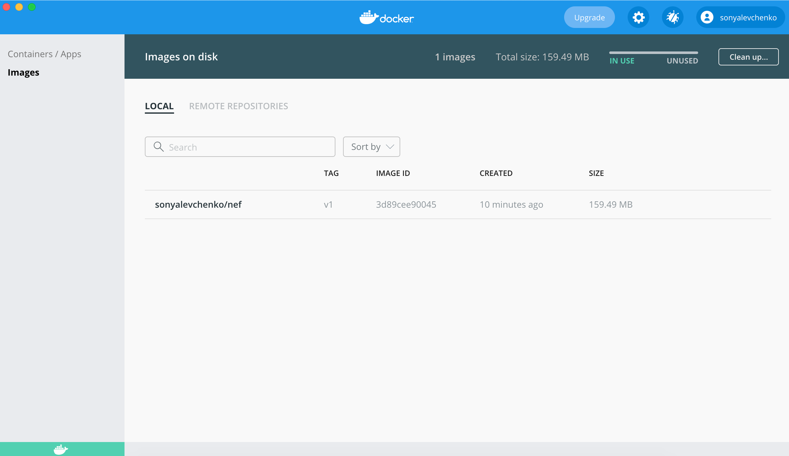
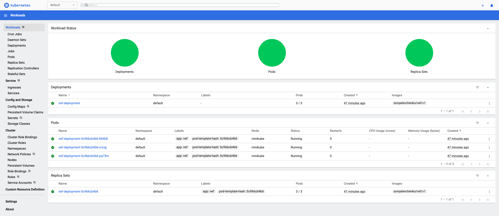

# Przenoszenie usług w sieci 5G w środowisku Kubernetes.

## Sprint 1

W pierwszym sprincie zapoznaliśmy się z podstawowymi obiektami jakie możemy stworzyć w środowisku Kubernetes. Używając serwera nginx udało się nam utworzyć statyczną stronę web reprezentującą pewną usługę dostępną w sieci 5G. Sam serwer był zainstalowany na maszynie wirtualnej, która została zdefiniowana używając Dockerfila. Używając narzędzia minikube bylismy w stanie w sposób przejrzysty zarządzać naszymi podami oraz deploymentami.

